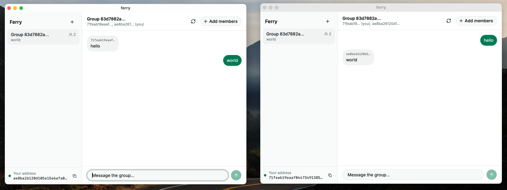

# Ferry

End-to-end encrypted group chat desktop app (Tauri + React), built on
[libchat](../libchat)'s opinionated Logos stack: `logos_chat::open` gives a
delegate identity, the HTTP keypackage + account registry, encrypted SQLite
storage, and an embedded logos-delivery (Waku) node as the transport. Groups
are GroupV2 conversations (de-mls): invites and member adds are staged as
proposals and committed asynchronously by an epoch steward. Ferry tunes the
GroupV2 timers down from the de-mls defaults (which wait ~60s before
committing) so invitees appear within a few seconds; messaging inside an
established group is near-instant since it needs no consensus round.



## Build and run

The `logos-delivery` crate links the native `liblogosdelivery`. Its build
script finds it via `LOGOS_DELIVERY_LIB_DIR`, or falls back to
`nix build .#logos-delivery` in the libchat repo.

```sh
pnpm install
pnpm tauri dev
```

## Building a distributable

`pnpm tauri dev` links `liblogosdelivery` by its absolute nix store path, which
is fine locally but does not exist on anyone else's machine. For a bundle that
runs elsewhere, build with `LOGOS_DELIVERY_RELOCATABLE=1`: the library keeps its
relocatable `@rpath`/`$ORIGIN` name, and `build.rs` copies it (plus `librln`,
which it loads beside itself) into `src-tauri/frameworks/` for Tauri to bundle
into `Contents/Frameworks`.

```sh
export LOGOS_DELIVERY_LIB_DIR="$(nix build .#logos-delivery --no-link --print-out-paths -f ../libchat)/lib"
export LOGOS_DELIVERY_RELOCATABLE=1
pnpm tauri build
```

Both variables are required together — `tauri.conf.json` always bundles
`frameworks/*.dylib`, so a `pnpm tauri build` without them fails on the missing
files. To confirm a build is self-contained, check that nothing points into the
store:

```sh
otool -L src-tauri/target/release/ferry | grep /nix/store   # expect no matches
```

## Trying group chat locally

Each profile keeps its own database and account. Run two instances with
different profiles:

```sh
FERRY_PROFILE=alice pnpm tauri dev
FERRY_PROFILE=bob   ./src-tauri/target/debug/ferry
```

In Alice's window copy your address (sidebar footer), create a group in Bob's
window, and paste Alice's address into the member list. The invite lands on
Alice's side once the group's steward commit finalizes (a few seconds with
Ferry's tuned timers).

Environment variables:

- `FERRY_PROFILE` — database/account profile name (default `default`).
- `FERRY_REGISTRY_URL` — override the account + keypackage registry endpoint
  (defaults to the devnet registry baked into libchat).

Note: the underlying `logos_chat::open` currently mints a fresh dev account on
every launch, so your address changes each time the app starts.
